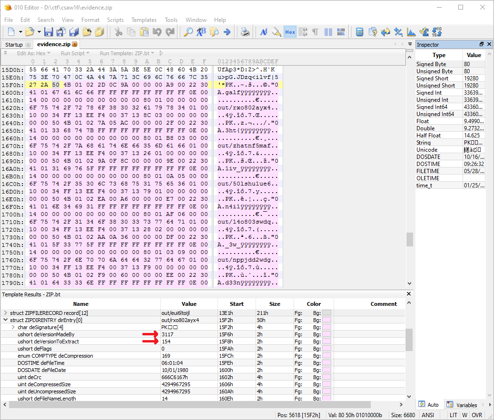

# CSAW Quals 2016: evidence.zip - Forensics 100

>As part of CSAW CTF's ongoing efforts to terminate cheaters with extreme prejudice, we were supposed to have evidence incriminating a handful of teams in this zip file. I do not know what happened, but I do not think the evidence actually made it in there...

We are given the file `evidence.zip`. When trying to extract the contents, most tools will complain about errors in the file:

```bash
$ unzip evidence.zip
Archive:  evidence.zip
   skipping: out/rxo802ayx4          need PK compat. v15.4 (can do v4.6)
   skipping: out/zhatnf5maf          need PK compat. v17.2 (can do v4.6)
   skipping: out/50lshu1ue6          need PK compat. v14.0 (can do v4.6)
   skipping: out/14o803swdq          need PK compat. v16.6 (can do v4.6)
   skipping: out/nppjdd2wdg          need PK compat. v5.4 (can do v4.6)
   skipping: out/e9ydsxwetg          need PK compat. v9.6 (can do v4.6)
   skipping: out/0eetjrxpdm          need PK compat. v17.1 (can do v4.6)
   skipping: out/otuj3jrezt          need PK compat. v12.7 (can do v4.6)
   skipping: out/m70ohrycax          need PK compat. v23.9 (can do v4.6)
   skipping: out/mpi3z4x5jt          need PK compat. v24.1 (can do v4.6)
   skipping: out/meoflsxv4v          need PK compat. v6.8 (can do v4.6)
   skipping: out/8y10tp04b2          need PK compat. v11.3 (can do v4.6)
   skipping: out/eui6ltoijl          need PK compat. v16.3 (can do v4.6)

```

Notice the errors about the version needed to extract the files. Let's see what's wrong with it:

The file records seem to be fine, however there are clearly a few problems with the directory entries. The first thing I notice are the random values assigned to the `Version made by` and `Version needed to extract` fields, which explains the errors we were getting before:



After inspecting this a bit more, I found that in every entry, after the signature (`PK\x01\x02`), there are exactly `24` extra bytes inserted before the correct entry data. Looking a little closer, you can see the flag in plaintext broken up across the extra bytes in every entry:

```
00001600: 4101 6761 6c66 ffff ffff ffff ffff 0e00  A.galf.......... => "flag"
00001650: 4101 3368 747b ffff ffff ffff ffff 0e00  A.3ht{.......... => "{th3"
000016A0: ...
...
```

And so on, until we have the full flag:

```
flag{th3_vi11i4n_w3_n33d_#freeleffen}
```
