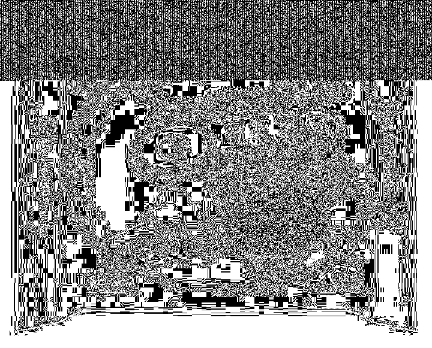
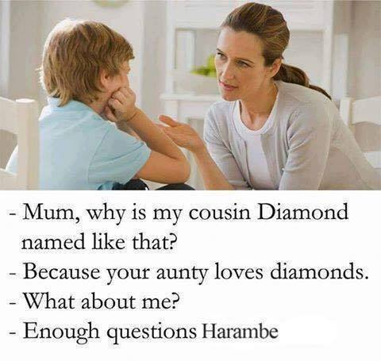

# CSAW Quals 2016: Watchword - Forensics 250

>Canned epic hidden snek flavored cookies have shy gorilla.

For this challenge we are given `powpow.mp4`

## MP4 Analysis

There were two main things to get out of this file. First, the artist/title of the video is a hint for a later step:

```bash
$ exiftool powpow.mp4
...
Artist                          : Stefan Hetzl
Title                           : aHR0cDovL3N0ZWdoaWRlLnNvdXJjZWZvcmdlLm5ldC8=
...
```

Stefan Hetzl is the author of `StegHide`, and the base64 decodes to `http://steghide.sourceforge.net/`. This is usually used with JPEGs, so we'll have to watch out for one later

Second, there is a PNG image appended to the video, so just separate it with any carving tool:

```bash
$ foremost powpow.mp4
Processing: powpow.mp4
|*|
$ cp output/png/00001069.png img1.png
```

And we get the following image:


## PNG Analysis

StegHide doesn't work with PNGs, so we have to keep looking. File carving doesn't get us anywhere here, so it must be something else. The PNG format is ideal for LSB steganography due to its lossless compression, so I looked into that next.

Using Stegsolve, I confirmed that there was in fact something hidden in the image:



This is just the blue LSB plane, and both red and green were used as well. Assuming the bit order is RGB, I tried to extract the encoded data with Stegsolve:

```
ff6c3fdc00008128 8c49230000202000  .l?....( .I#..  .
0002000080000ff6 d8008600048180e0  ........ ........
8038181208040201 40a0482c1c170783  .8...... @.H,....
81a0d07070281508 85c441e1188c421e  ...pp(.. ..A...B.
100804a2a1a8b44a 27190a04020170fc  .......J '.....p.
...
```

It starts out with `\xFF`, which is what we would want for a JPEG, but the rest is junk, so I wrote my own script to try and figure it out myself. Since I'm looking for a JPEG, I'm expecting `\xFF\xD8` as the header, and looking at the stream of bits, we can see how this encoding works:

```
111111110110110000111111110111000000000000000...
|  FF  | |  D8  | |  FF  | |  E0  | |  00  | ...
```

There's just a extra bit placed after every encoded byte, so if I skip every 9th bit when I convert the binary to ascii, I should get the image. Here is the final script:

```python
#!/usr/bin/env python
from PIL import Image
import sys

def b2a(b):
    s = ''
    while len(b) != 0:
        binbyte = b[:8]  # Get a byte
        s += chr(int(binbyte, 2)) # Convert it
        b = b[9:]  # Skip every 9th bit
    return s

# Load image data
img = Image.open(sys.argv[1])
w,h = img.size
pixels = img.load()

binary = ''
for y in xrange(h):
    for x in xrange(w):
        # Pull out the LSBs of this pixel in RGB order
        binary += ''.join([str(n & 1) for n in pixels[x, y]])
print b2a(binary)
```

And the result:

```bash
$ ./lsb.py img1.png > img2.jpg
```



## Using Steghide

So now we have a JPEG, but where's the password? Well, it's not there :( you can either run a dictionary attack or guess that the password is `password`.

```bash
$ steghide extract -sf img2.jpg -p password
wrote extracted data to "base64.txt".
$ cat base64.txt
W^7?+dsk&3VRB_4W^-?2X=QYIEFgDfAYpQ4AZBT9VQg%9AZBu9Wh@|fWgua4Wgup0ZeeU}c_3kTVQXa}eE
```

## "Base64"

It's not, it's base85

```
$ python3
>>> import base64
>>> base64.b85decode('W^7?+dsk&3VRB_4W^-?2X=QYIEFgDfAYpQ4AZBT9VQg%9AZBu9Wh@|fWgua4Wgup0ZeeU}c_3kTVQXa}eE')
flag{We are fsociety, we are finally free, we are finally awake!}
```
